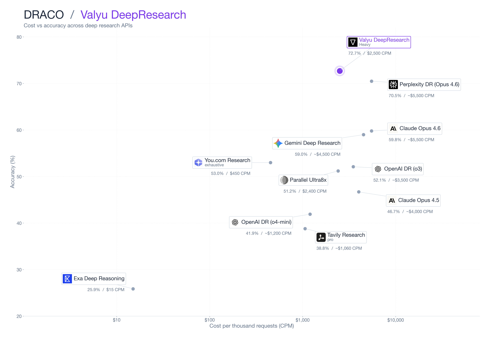

# Valyu Benchmarks

Open benchmarks for AI research and search systems. Every score in this repo traces back to a captured inference output and a per-criterion judge grading — scripts, raw outputs, and eval files are all included so anyone can verify or reproduce.

## DRACO — long-form deep research synthesis



DRACO ([Perplexity, 2026](https://arxiv.org/abs/2602.11685)) is an expert-rubric benchmark of 100 long-form deep research tasks across 10 professional knowledge-work domains, graded against per-task rubrics of 30–60 weighted requirements.

**Valyu DeepResearch (Heavy)** leads at **72.7%**, ahead of every commercial deep research API tested, at less than half the cost of the next-best system.

Full methodology, the headline leaderboard, per-domain breakdown, and reproduction details: [`draco/outputs/full/README.md`](draco/outputs/full/README.md).

## What's in this repo

```
draco/
├── outputs/full/        canonical results — README, scores.json, inference, grading, charts
├── run.py               Valyu DeepResearch runner
├── run_parallel.py      Parallel Task API runner
├── run_youcom.py        You.com Research API runner
├── run_tavily.py        Tavily Research API runner
├── run_exa.py           Exa Deep Reasoning runner
└── eval/rubric_eval.py  per-criterion judge (gemini/gemini-3-pro-preview)
```

## Reproducing

```bash
pip install -r requirements.txt

# Download the DRACO dataset from HuggingFace into datasets/draco.jsonl
python3 draco/download.py

# Set your provider keys in .env.local (VALYU_API_KEY, PARALLEL_API_KEY,
# YDC_API_KEY, TAVILY_API_KEY, EXA_API_KEY, GOOGLE_GENERATIVE_AI_API_KEY)
export $(grep -v '^#' .env.local | xargs)

# Run a provider (Valyu, Parallel, You.com, Tavily, Exa)
python3 draco/run.py
python3 draco/run_parallel.py --processor ultra8x

# Grade with the same per-criterion judge used for our results
python3 draco/eval/rubric_eval.py --input draco/outputs/full/inference/<system>.jsonl
```
